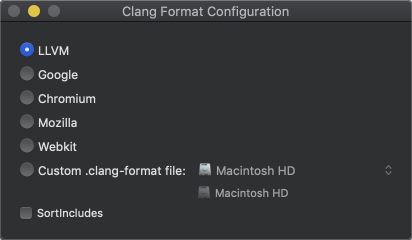
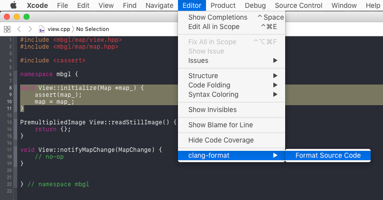
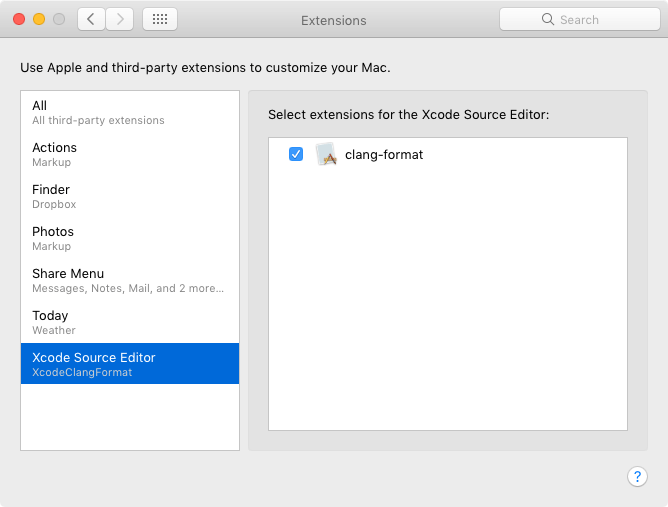
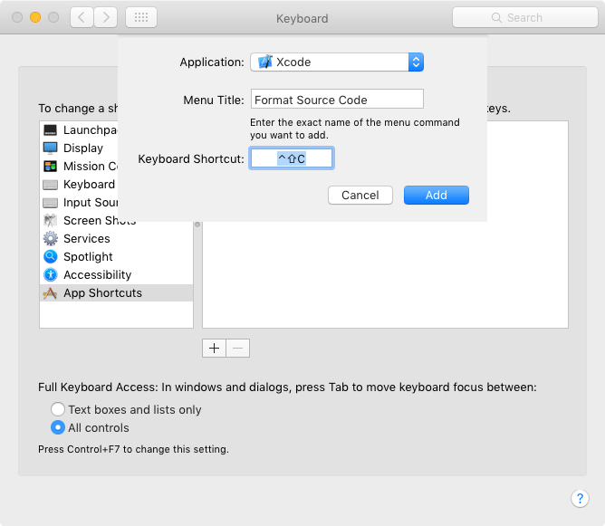

# XcodeClangFormat

### [⚙ Download Latest Release](https://github.com/mapbox/XcodeClangFormat/releases/latest)
Uses `clang-format` from [Clang 10](https://releases.llvm.org/10.0.0/tools/clang/docs/ClangFormat.html)

...or install with Homebrew: `brew cask install xcodeclangformat`

This plugin is written for Xcode 8's new plugin infrastructure and compatible through at least Xcode 11.4 It uses Clang's `libclangFormat` library to format code according to a `.clang-format` file.

Open the app, select a predefined style, or open the `.clang-format` file from your project:

Then, use the <kbd>Format Source Code</kbd> command in Xcode's <kbd>Editor</kbd> menu:

Due to macOS sandboxing restrictions, this plugin behaves slightly differently compared to the command line `clang-format` command: It always uses the style selected in the configuration app, and will not use the nearest `.clang-format` file on disk.

## Installing

Download the precompiled app or [build it yourself](#building), then open the app. You might have to right click on the app bundle, and choose <kbd>Open</kbd> to run non-codesigned applications. Then,

* On OS X 10.11, you'll need to run `sudo /usr/libexec/xpccachectl`, then **reboot** to enable app extensions.
* On macOS Sierra and later, extensions should be loaded by default.

Then, go to *System Preferences* → *Extensions*, and make sure that **clang-format** in the *Xcode Source Editor* section is checked:

## Keyboard shortcut

To define a keyboard shortcut, open Xcode's preferences, and switch to the *Key Bindings* tab. Duplicate the default key binding set if you don't have your own set already. Search for `clang-format`, then add your preferred key bindings for `Format Selection` or `Format Entire File`.

## Building

To build XcodeClangFormat, run `./configure` on the command line, then build the XcodeClangFormat scheme in the included Xcode project.

## FAQ

##### Why aren't you just using the `.clang-format` file in the file's parent folder?
Xcode code formatting extensions are severely limited and don't have access to the file system. They also don't get to know the file name of the file to be changed, so there's no way for this extension to load the correct file.

##### Could you please add “Format on Save”?
The Xcode extension mechanism doesn't allow that; the only thing you can do is return the altered source code.

##### Why doesn't the menu item show up?
If you're using macOS Sierra, please follow the [installing](#installing) guide. on OS X 10.11, I haven't found a way to make this extension work besides [manually building it](#building).

If the menu items randomly disappears, quit Xcode. In Finder, [rename `Xcode.app` to something else, then rename it back to `Xcode.app`](https://stackoverflow.com/a/48893833). 🤯

##### When compiling, I'm getting `'clang/Format/Format.h' file not found`.
Make sure that you're running `./configure` in the root folder. This downloads and unpacks the precompiled libraries and headers from the llvm.org that are required for compiling.
